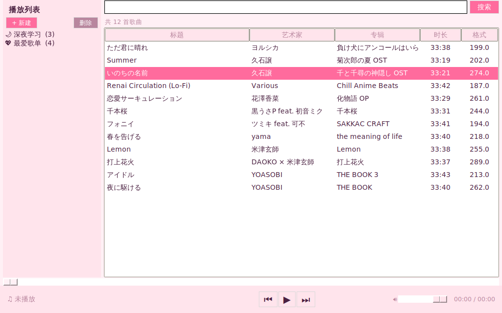
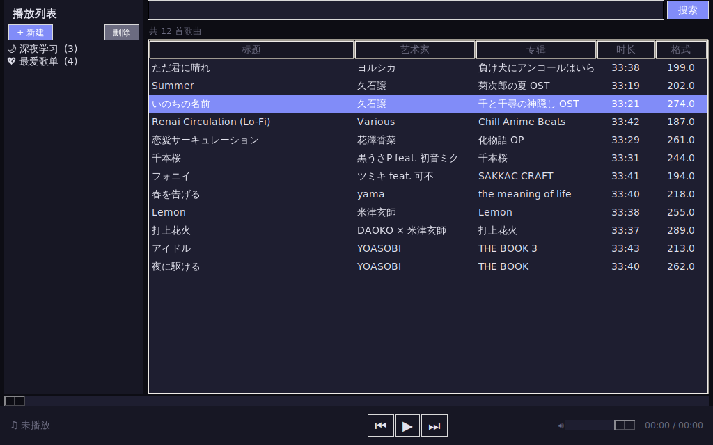
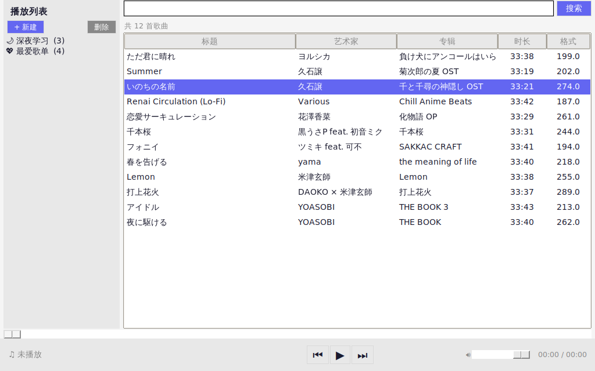

# ✨ 萌音工作室 · Moe Music Studio ✨

> 🎶 **本地音乐管理播放器 —— 管理、播放、转换，一站搞定** 🎶

🐍 Python 3.10+ &nbsp;|&nbsp; 🗄️ SQLite 3 &nbsp;|&nbsp; 🎵 pygame 2 &nbsp;|&nbsp; 📄 MIT License

---

## 📥 下载（普通用户看这里！）

**不用装 Python、不用配 ffmpeg**，下载解压双击就能用：

👉 **[前往 Releases 页面下载最新版](https://github.com/MeachalLouisJunyan/moe-music-studio/releases/latest)**

| 平台 | 文件 | 说明 |
|------|------|------|
| 🪟 Windows | `JyMusic-vX.X.X-windows.zip` | 解压后双击 `JyMusic.exe`。SmartScreen 若提示「未知发布者」，点「更多信息 → 仍要运行」 |
| 🍎 macOS (Apple Silicon) | `JyMusic-vX.X.X-macos.dmg` | 拖进「应用程序」。首次打开请**右键 → 打开**（应用未签名） |

> 转换功能所需的 ffmpeg 已经打包在里面啦，零配置开箱即用 ✨

### 🔒 放心用

- **完全离线，零数据收集** — 无联网、无遥测、无广告、无账号，详见 [隐私承诺](PRIVACY.md)
- **开源可审计** — 全部代码公开（[MIT 许可证](LICENSE)），你下载的就是这里构建的
- **可验证下载** — 每个安装包附带 `.sha256` 校验文件：
  - Windows：`certutil -hashfile JyMusic-vX.X.X-windows.zip SHA256`
  - macOS：`shasum -a 256 JyMusic-vX.X.X-macos.dmg`
  - 算出的值和 `.sha256` 文件里的一致，就说明包没被篡改
- **关于"未知发布者"警告** — 那是因为个人开发者没有购买代码签名证书（一年几百美元），
  不代表软件有问题。安装包由 GitHub Actions 从本仓库源码公开构建，构建日志人人可查

---

## 🌸 这是什么？

**萌音工作室**是一只萌萌哒本地音乐管理播放器 desu~  
用 Python 精心打造，帮你把乱糟糟的音乐库整理得井井有条！  
播放、管理、转换格式，**一键搞定**，再也不用在多个软件之间切来切去啦 (๑•̀ㅂ•́)و✧

---

## ✨ 功能特色

| | |
|---|---|
| 🗂️ **音乐库管理** | 基于 SQLite 数据库，自动扫描目录，导入 **50+** 种音频格式 |
| ▶️ **音频播放** | pygame 引擎驱动，流畅播放各种主流音频格式 |
| 🏷️ **标签编辑** | 直接修改音频文件的元数据标签，想改就改 |
| 📋 **播放列表** | 创建你的专属播放列表，随心组合 |
| 🔄 **格式转换** | 内置转换工具，轻轻一点格式就变啦 |
| 🎨 **三款主题** | 萌系粉 ✦ 暗黑系 ✦ 清新白，总有一款适合你 |
| 🖱️ **拖拽支持** | 文件直接拖进来，超方便的说~ |

---

## 🚀 安装指南

### 📥 前置条件

- Python **3.10** 或更高版本
- **ffmpeg** 要添加到系统 PATH（转换格式需要她帮忙）

### 🛠️ 安装步骤

```bash
# 第一步：安装依赖
pip install -r requirements.txt

# 第二步：启动~\\(≧▽≦)/~
python main.py
```

### 📦 依赖酱

| 名称 | 使命 |
|------|------|
| **pygame** 🎵 | 音频播放引擎，让音乐响起来！ |
| **tkinterdnd2** 🖱️ | 可选，支持文件拖拽操作 |

### 🎵 支持的音乐格式

> **50+ 种格式全兼容！** 包括但不限于：
>
> `mp3` `flac` `wav` `ogg` `aac` `wma` `m4a` `ape` `opus` `aiff` `au` `mid` `midi` `voc` `raw` `tta` `tak` `wv` `xm` `mod` `it` `s3m` …… 还有好多好多！

---

## ⚙️ 技术栈

```
🎨 UI 界面  ——  Tkinter
🗄️ 数据库  ——  SQLite
🎵 播放引擎 ——  pygame
🔄 格式转换 ——  内置转换器 + ffmpeg
🖱️ 拖拽支持 ——  tkinterdnd2
```

---

## 📸 截图

| 🌸 萌系粉 | 🌙 暗黑系 | ☁️ 清新白 |
|:---:|:---:|:---:|
|  |  |  |

---

## 🤝 一起来玩！

发现了 Bug？有好的想法？欢迎提 **Issue** 或 **Pull Request** 哦！  
在动手之前，记得先看看项目规范 (◕‿◕✿)

---

## ☕ 支持作者

本软件**完全免费**。如果她帮到了你，可以请作者喝杯奶茶，
这是让开发继续下去的最大动力！(๑´ㅂ`๑)

- ⭐ 给仓库点个 Star
- 💖 [爱发电](https://ifdian.net/a/LOUISMEACHALJUNYAN) — 请作者喝杯奶茶
- 💜 [GitHub Sponsors](https://github.com/sponsors/MeachalLouisJunyan) — 持续支持
- ☕ 应用内「帮助 → 支持作者」也可以直达

---

## 📄 许可证

本项目采用 [MIT](LICENSE) 许可证 — 随意玩耍，开心就好 ✨

---

<p align="center">
  <b>⭐ 如果觉得有用，给个星星吧！ ⭐</b><br>
  <a href="https://github.com/MeachalLouisJunyan/moe-music-studio">https://github.com/MeachalLouisJunyan/moe-music-studio</a>
</p>
